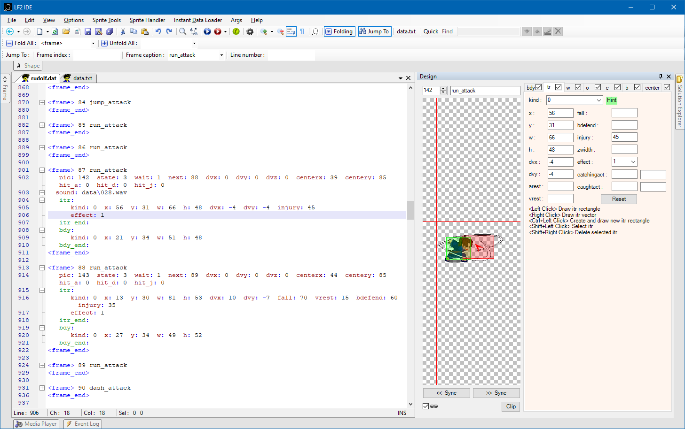
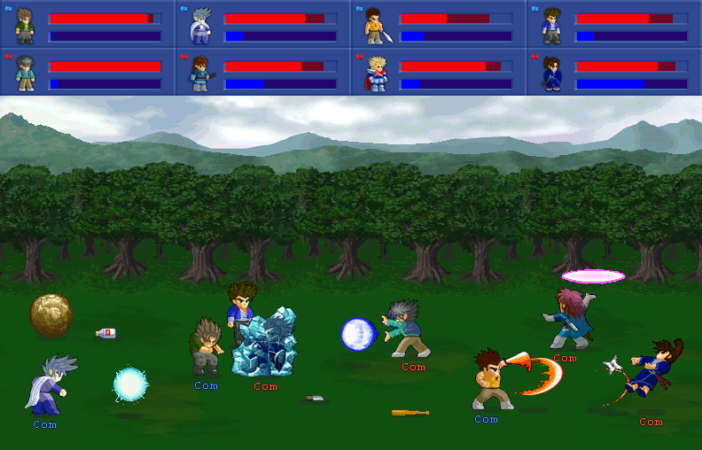

  
LF2 IDE  
    
=======
Little Figther 2 Integrated Development Environment

LF2 IDE is a graphical game modding toolkit for Little Fighter 2, also known as a "Data Changer". It allows you to edit data files (`*.dat`) of the game with wide range of convenient features to make it easier for LF2 data changers / modders. It was originally announced on Little Fighter Empire forums in this thread: https://lf-empire.de/forum/showthread.php?tid=9064

Features
--------
- Code editor with syntax highlighting, code folding and auto-complete support
- Integrated visual designer tools
- Instant Data Loader (IDL): Loads data files into LF2's memory allowing you to see your changes instantly
- Solution Explorer window for navigating the LF2 directory inside LF2 IDE
- Integrated media player
- Sprite tools such as transparency tool, image pixel formatter and sprite mirrorer
- Plugin support

Downloads
---------
Head to [Releases](https://github.com/ahmetsait/LF2.IDE/releases) section for downloads.

License
-------
LF2 IDE is licensed under the [MIT License](LICENSE).

About Little Fighter 2
----------------------
LF2 is a 2D beat 'em up fighting game made by Marti Wong & Starsky Wong. It is extremely customizable with its data file architecture allowing modders to create characters, weapons, levels and even stories from scratch.

  
See the official website: https://lf2.net
